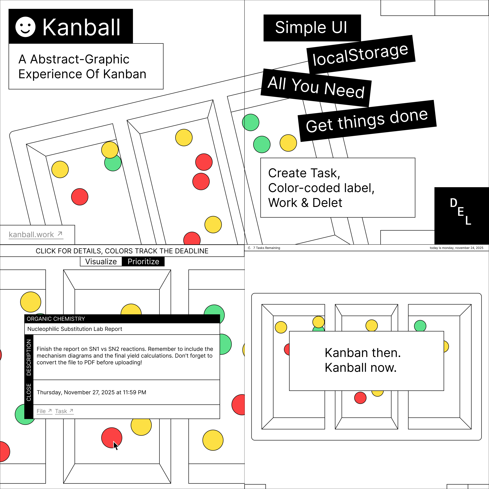
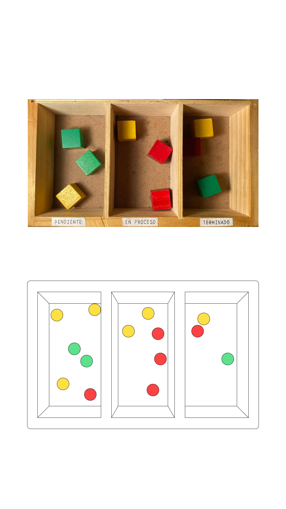

# Kanball

An Abstract-Graphic Experience Of Kanban.

Kanball is a practical, graphic integration that elevates the Kanban management method into a minimalist, convenient, and simple experience. Designed for absolute focus, fluidity, and zero visual friction when organizing your day.

---

## Philosophy

* **MinimalGraphic:** A clean interface stripped of unnecessary elements.
* **A Polished Work & Design:** Carefully crafted aesthetics for a seamless user experience.
* **A Simple Tool — A Powerful Tool:** Only the essential features (*All You Need*), executed perfectly.

## Core Features

* **Abstract Visualization:** Tasks are represented organically. Colors track deadlines and help you prioritize at a glance.

*The Origin: This compact physical system is where the idea for Kanball was born.*

* **Privacy (localStorage):** No external databases or sign-ups. Your data and tasks live exclusively within your browser.
* **Intuitive Workflow:** *Create Task, Color-coded label, Work & Delete.* The perfect cycle to *Get things done*.

---

## Try it now

No installation or complex setups required. Start managing your tasks directly from the web:

**[Visit kanball.work](https://kanball.work)**

---

## Links

* Learn more about the visual concept and support the project on **[Instagram](https://www.instagram.com/p/DReHm69kaJm/)**.
